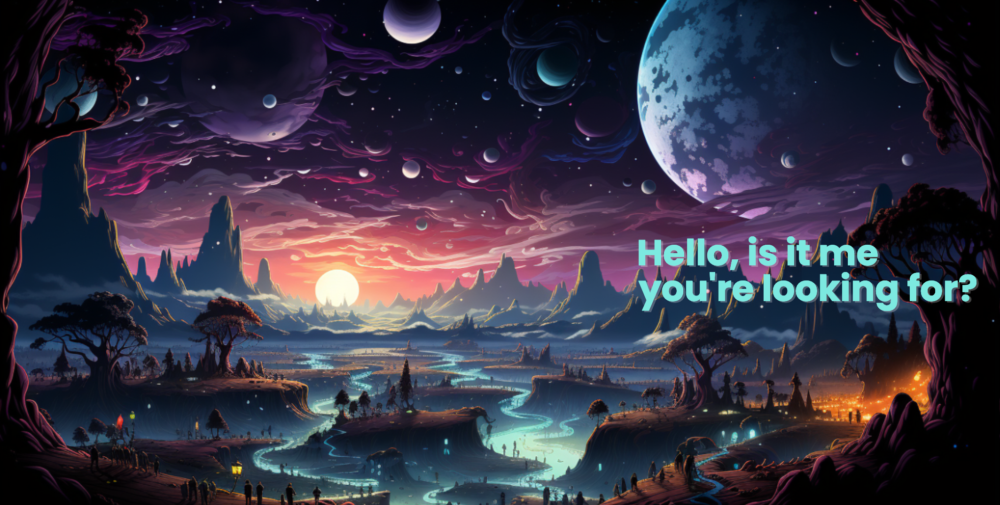

 

  

 

## 🌌 My Cosmic Code Odyssey 🌠

🌌👩‍🚀 Hello, fellow explorers of the digital universe! ✨ I'm Lev, a passionate coder ⚡ driven by endless curiosity 🛸 and the thrill of innovation 🌠. 

This is the path I've forged in the vast landscape of technology: 🚀🖥️

🪐 **Genesis**: My adventure in the digital cosmos began with C++ during my foray into competitive programming, sparking a lifelong passion for creation and innovation.

🌠 **Stellar Moments**: Navigating the boundless code constellations, I found a place among the stars at [8base](https://www.8base.com/), where I embarked on crafting diverse **B2C projects of varying complexities**. Each endeavor, a unique cosmic melody. 🚀🎵

🌌 **Mastery in the Milky Way**: On this voyage, not only have I honed my skills in **JavaScript, TypeScript, React, GraphQL, Apollo GraphQL, and AWS Services**, but I've also **sharpened my interviewing prowess**. I introduced and developed a novel system for evaluating potential stars, ensuring our constellation shines brighter every day. 🌠✨

🚀 **The Voyage Continues**: The vast expanse of the digital universe is ever-expanding, mirroring my own aspirations. As of now, I harness the digital energies as a **Middle+ Front End Developer** at **Refundd LLC**. But my sights are set on the horizons – aiming to master the realms of Full Stack Web Development, ensuring every line of code I craft has a touch of magic and a dash of stardust.

## 🪐 Connect & Converse 🪐

Should our stars align, or if you're keen to exchange cosmic insights, don't hesitate to connect!

<!--  -->
<!--  -->
<!-- Add other badges as needed -->

## 🌌 My Tech Constellations 🚀

 
 
 

 
 
 
 
 
 

<!-- 
## 💼 My Code Palette 🎨

 -->
